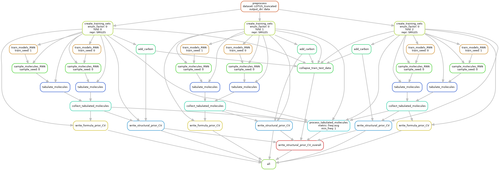

## Snakemake workflow

The included `Snakefile` provides a way to run the end-end workflow for the
`NPS-generation` repository.

The following dependency graph illustrates the steps that would be run, when
running the workflow for 3 folds and 2 seeds (This is the configuration provided
in the file `config_fast.json`).




### Testing the workflow

To run this workflow on the LOTUS dataset:

#### Steps

1. Install `NPS-generation` to get all the dependencies, including `snakemake`.
```
cd /path/to/repo
pip install -e .
```

2. Download the LOTUS.txt dataset and note its location.
3. Download the PubChem dataset and note its location.
4. Run the following command to see the steps (including the actual commands) that will be run:

```
snakemake --configfile config_fast.json --config dataset=/path/to/LOTUS.txt pubchem_tsv_file=/path/to/PubChem.tsv --jobs 1 --dry-run -p
```

5. Repeat the command without the `--dry-run -p` to execute the workflow. The end-end workflow should take around 10-15 minutes.


### Running the "real" workflow

To run the end-end workflow on the LOTUS dataset on a cluster, repeat the above process, but with a few tweaks

a. Add the `--slurm` flag to indicate that the steps should be run using `sbatch`.

b. Replace the `--configfile config_fast` with `--configfile config.json` (or eliminate this flag altogether).

c. Increase the value of the `--jobs` flag to specify the maximum number of slurm jobs to run at a time.

#### Steps

1. Install `NPS-generation` to get all the dependencies, including `snakemake`.
```
cd /path/to/repo
pip install -e .
```

2. Download the LOTUS.txt dataset and note its location.
3. Download the PubChem dataset and note its location.
4. Run the following command to see the steps (including the actual commands) that will be run:

```
snakemake --config dataset=/path/to/LOTUS.txt pubchem_tsv_file=/path/to/PubChem.tsv --jobs 10 --dry-run -p
```

5. Repeat the command without the `--dry-run -p` to execute the workflow. The end-end workflow should take around 12-15 hours, depending on the cluster workload.

Note that running `snakemake` in a foreground process will run the workflow in blocking mode. Though actual jobs will be submitted to compute nodes, pressing
Ctrl-C will cause `snakemake` to attempt to cancel pending/currently running jobs (through `scancel`). You should thus run the actual workflow in the background
using `&`, or use an environment like `tmux` that you can detach/attach to on demand.

```
snakemake --config dataset=/path/to/LOTUS.txt pubchem_tsv_file=/path/to/PubChem.tsv --jobs 10 &
```

### Other useful commands

To generate the DAG dependency graph that you see above:
```
snakemake --forceall --dag | dot -Tpng > dag.png
```